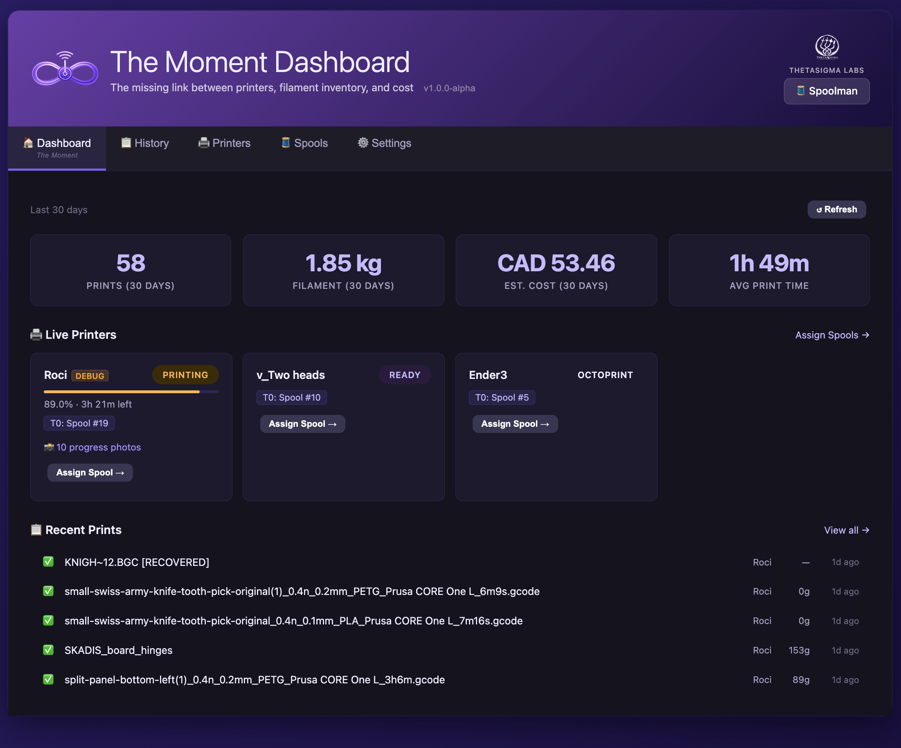
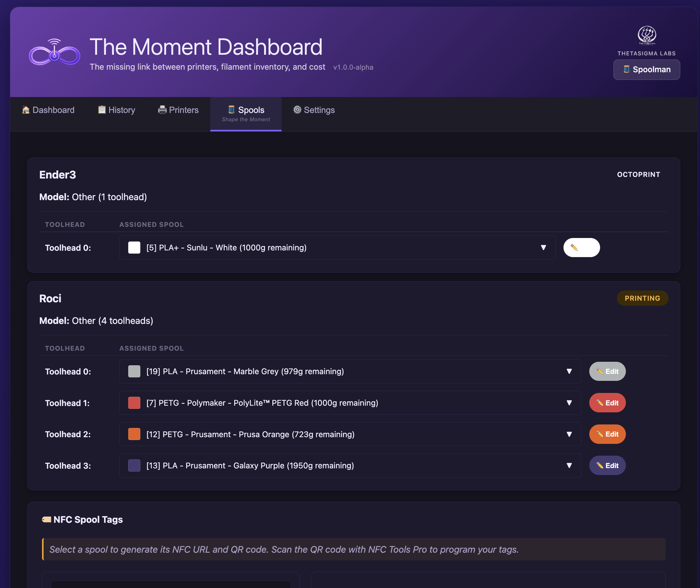
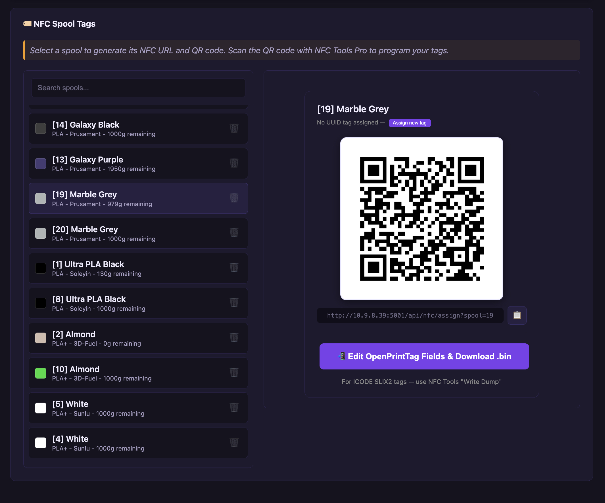
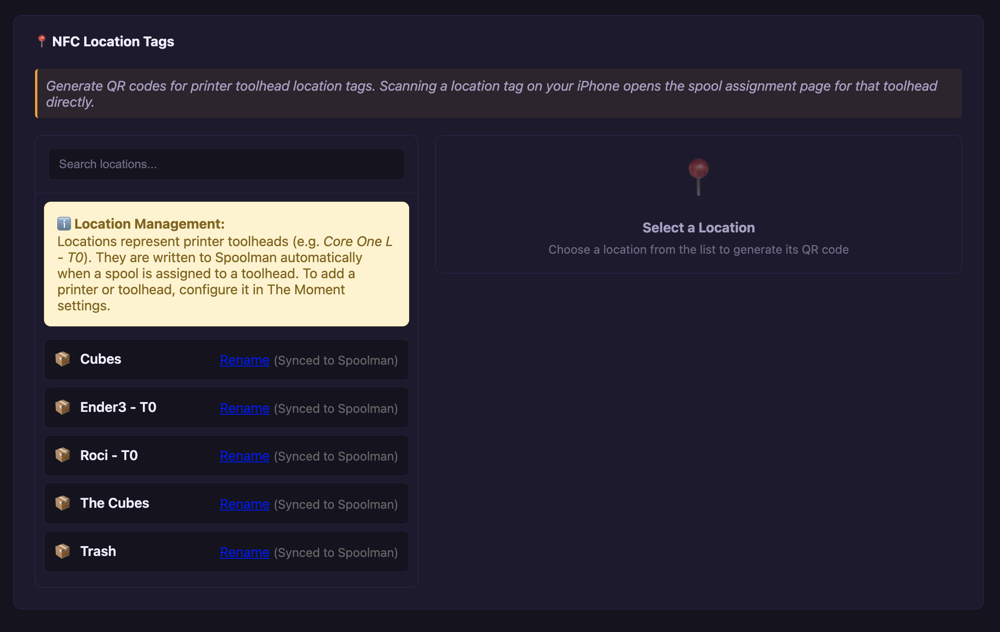

# The Moment

[](https://www.gnu.org/licenses/gpl-3.0)
[](https://golang.org/)
[](https://github.com/ThetaSigmaLabs/the-moment/releases)
[](https://github.com/ThetaSigmaLabs/the-moment/stargazers)

**Automatic filament tracking, print history, and cost accounting for every 3D printer you own — connected to [Spoolman](https://github.com/Donkie/Spoolman) in real time.**

Every gram used. Every minute spent. Every dollar it cost. Logged automatically, the moment a print finishes.

---


*Live printer status with toolhead spool assignments across all printers*

---

## Deploy in 3 Commands

No git clone. No build step. Just Docker.

```bash
curl -O https://raw.githubusercontent.com/ThetaSigmaLabs/the-moment/main/docker-compose.yml
curl -O https://raw.githubusercontent.com/ThetaSigmaLabs/the-moment/main/.env.example && cp .env.example .env
docker compose up -d
```

Open `http://<your-server-ip>:5000` → Settings → Add Printer. Done.

> **Prerequisites**: Docker with Compose, and [Spoolman](https://github.com/Donkie/Spoolman) — The Moment bundles Spoolman in the compose file so you get both with those three commands.

### First time? Read this first

The Moment reads filament and spool data from Spoolman — it doesn't create filament, spool, or location records there. **Add your filament types and spools in Spoolman before your first print**, or there will be nothing to assign to a toolhead.

Then: open The Moment → Settings → Add Printer → go to Print Ops → assign a spool to the toolhead → print.

Full step-by-step: [docs/first-run.md](docs/first-run.md)

---

## The Problem

You finish a print. Now you have to open Spoolman, find the spool, calculate how much filament you used, update the weight, log the print time, figure out what it cost in electricity and filament, and write a note so you remember which printer ran it.

You don't. Nobody does.

## The Solution

The Moment sits between your printers and Spoolman. When a print finishes it automatically: deducts filament from Spoolman, logs the print with duration and cost, records which spool was on which toolhead, and stores a thumbnail if your slicer embedded one. You never touch Spoolman manually again.

---

## Features

### Filament & Spool Tracking

- **Automatic deduction** — filament weight updated in Spoolman the moment a print finishes
- **Multi-toolhead** — each toolhead tracks its own spool independently (tested with Core One L via manual filament changes; designed for future INDX multi-toolhead upgrade)
- **Filament-change tracking** — spool swaps mid-print recorded as separate entries; each change gets its own usage row
- **Location tracking** — spools carry their location (printer toolhead or storage shelf) in Spoolman; bidirectional sync keeps them in agreement


*Assign spools to toolheads; search by name, material, brand, or color*

### Complete Print History

- **Every print logged** — source printer, spool used, filament consumed (grams), duration, cost breakdown
- **Session grouping** — multi-toolhead prints grouped as one job; open the print dialog to see per-tool breakdown, snapshots, cost details, and attached G-code
- **Thumbnails** — G-code preview images extracted from PrusaSlicer/OrcaSlicer and displayed in history
- **Notes** — add freeform notes to any history entry after the fact
- **Searchable, deletable** — clean up test prints; filter by printer or date

### Cost Accounting

- **Filament cost** — priced from Spoolman's per-spool cost, prorated by grams used
- **Electricity** — configurable kWh rate × print wattage × duration
- **Preheat charge** — one-time electricity cost for bed and hotend warmup
- **High-temp surcharge** — automatically applied when Spoolman identifies the material as ABS, ASA, PA, or PC
- **Maintenance and depreciation** — per-hour rates spread across print time
- **Profit margin** — optional markup for print-as-a-service
- **Per-printer overrides** — each printer has its own wattage, preheat spec, and depreciation rate
- **Quick calculator** — test cost settings with arbitrary filament weight and time, no hardware required
- **Currency** — configurable ISO code (USD, CAD, EUR, GBP, etc.)

### NFC Tags — Physical Filament Intelligence

Tap a spool with your iPhone. Tap the printer slot. Done — the spool is assigned to that toolhead in The Moment and Spoolman simultaneously.

- **Spool tags** — ICODE SLIX2 programmed via NFC Tools Pro; dual-record NDEF (OpenPrintTag CBOR + URL fallback)
- **Location tags** — one per printer toolhead; tap spool then location (or location then spool) within 5 minutes
- **QR codes** — generated alongside every NFC tag for environments where NFC isn't available
- **OpenPrintTag CBOR** — spool tags allow a full [OpenPrintTag](https://specs.openprinttag.org)-compatible CBOR record: temperatures, color, weight, UUID, manufacturing date, material properties


*Generate NFC tag files and QR codes for every spool in your Spoolman library*


*Location tags for each printer toolhead and storage locations*

### Supported Printers

| Printer | Interface | Multi-toolhead | Status |
|---|---|---|---|
| Any PrusaLink printer (CORE One, XL, MK4, Mini+) | PrusaLink API | Yes (Core One L tester with 5 heads manual changing) | Fully supported |
| Any OctoPrint printer (Ender, CR-10, Voron, etc.) | OctoPrint plugin | Single-head | Fully supported |
| Bambu | MQTT over LAN | AMS slots → toolheads | Planned |
| INDX 8-head | TBD | 8 toolheads | Future |

### Virtual Test Printers

Simulate prints without hardware. Upload a G-code file, click Process — filament usage is parsed from the file, Spoolman is updated, and a full history entry with cost breakdown is created. Use it to validate your cost settings before your first real print.

Export a virtual printer with its G-code library as JSON; import it on another instance.

---

## Installation

### Option 1: Docker (recommended)

The three-command deploy above gets you running. For a Makefile-driven workflow after the initial deploy:

```bash
make setup   # creates .env from .env.example + data directories
make up      # start The Moment + Spoolman
make logs    # tail live logs
make update  # pull latest images and restart
make backup  # archive all data to ./backups/
```

Run `make help` to see all available targets.

Full deployment documentation: [docs/deployment.md](docs/deployment.md)

### Option 2: Pre-built Binary

Download the latest binary for your platform from the [Releases page](https://github.com/ThetaSigmaLabs/the-moment/releases):

| Platform | File |
|---|---|
| Linux amd64 | `the-moment-linux-amd64` |
| Linux arm64 (Raspberry Pi, Odroid) | `the-moment-linux-arm64` |
| macOS Intel | `the-moment-darwin-amd64` |
| macOS Apple Silicon | `the-moment-darwin-arm64` |
| Windows | `the-moment-windows-amd64.exe` |

```bash
chmod +x the-moment-linux-arm64
./the-moment-linux-arm64
```

Start Spoolman separately or via Docker, then open `http://localhost:5000`.

### Option 3: Build from Source

```bash
git clone https://github.com/ThetaSigmaLabs/the-moment.git
cd the-moment
go build -o the-moment .
./the-moment
```

Go 1.24 or higher is required.

---

## Printer Setup

### PrusaLink

1. Settings → Printers → Add Printer
2. Set Type to `PrusaLink`, enter the printer's LAN IP and API key
3. Set Toolheads to `1` to `10` for XL, INDX, or virtual tool heads for manual changes)
4. Save — The Moment polls on the next cycle

The Moment must be configured before the first print. Prints that occur before the printer is added are not recorded.

### OctoPrint

The Moment ships an OctoPrint plugin that pushes print events directly.

**Plugin setup:**

1. Install the plugin: Settings → Plugin Manager → Upload `octoprint-the-moment.zip` from the [Releases page](https://github.com/ThetaSigmaLabs/the-moment/releases)
2. In OctoPrint → Settings → The Moment: set **URL** to `http://<your-server>:5000` and **Printer ID** to a short name like `ender3`
3. In The Moment → Settings → Printers → Add Printer with the same name

> The Moment accepts print records from any authenticated OctoPrint instance even before the printer config exists — no print data is ever lost. Create the config before the first print to get accurate per-printer cost rates from day one.

Full plugin documentation: [docs/octoprint-plugin.md](docs/octoprint-plugin.md)

### Bambu

> **Planned — not yet available.** MQTT client is implemented in `bambu.go` but disabled in the UI pending hardware testing. See [ROADMAP.md](ROADMAP.md) for status.

---

## Configuration

All configuration lives in the SQLite database and is managed through the web UI. No config files.

### Web Interface

| Tab | What it does |
|---|---|
| **Dashboard** | Live printer status, current jobs, toolhead-to-spool assignments |
| **History** | Full print history with cost breakdown, notes, thumbnails; grouped by session |
| **Spools** | Assign spools to toolheads; NFC spool tag generation and QR codes |
| **Filaments** | Manage filament profiles; edit OpenPrintTag NFC fields (temps, material class, colors) |
| **Printers** | Add/remove printers; NFC location tag generation; stuck spool assignment cleanup |
| **Settings** | Basic config (Spoolman URL, timeouts), cost settings (global + per-printer overrides), advanced options, About |

### Cost Settings

**Global** (Settings → Cost Settings):

| Setting | Purpose |
|---|---|
| Electricity rate | $/kWh |
| Default wattage | Printer power draw in watts |
| Maintenance rate | $/hour for wear and consumables |
| Depreciation rate | $/hour or derived from purchase cost ÷ lifespan |
| Profit margin | % markup for print-as-a-service |
| Currency | ISO code: USD, EUR, GBP, CAD, AUD, etc. |

**Per-printer** (Settings → Cost Settings → Per-Printer Overrides): wattage, preheat charge, high-temp extra wattage, depreciation rate — all override the global defaults for that printer only.

### NFC Spool Assignment Workflow

1. Spools tab → generate a spool tag for each physical spool
2. Printers tab → generate location tags for each printer toolhead
3. Write the tags using [NFC Tools Pro](https://apps.apple.com/app/nfc-tools/id1252962749) on iPhone
4. To assign: tap the spool tag → tap the toolhead location tag (within 5 minutes)
5. Spoolman location field updates automatically

---

## API Reference

The Moment exposes a REST API for integration with other tools and the OctoPrint plugin.

### Printers & Config

| Method | Endpoint | Description |
|---|---|---|
| `GET` | `/api/status` | Current printer status and spool mappings |
| `GET` | `/api/printers` | List all configured printers |
| `POST` | `/api/printers` | Add a printer |
| `PUT` | `/api/printers/:id` | Update a printer |
| `DELETE` | `/api/printers/:id` | Delete a printer |
| `POST` | `/api/printers/virtual` | Add a virtual test printer |
| `GET` | `/api/printers/:id/export` | Export virtual printer to JSON |
| `POST` | `/api/printers/import` | Import virtual printer from JSON |
| `GET` | `/api/detect_printer` | Auto-detect printer type from URL |
| `GET` | `/api/config` | Get all config key/value pairs |
| `POST` | `/api/config` | Update config |

### Virtual Printer Files

| Method | Endpoint | Description |
|---|---|---|
| `GET` | `/api/printers/:id/files` | List uploaded G-code files |
| `POST` | `/api/printers/:id/files` | Upload a G-code file |
| `DELETE` | `/api/printers/:id/files/:file_id` | Delete a file |
| `POST` | `/api/printers/:id/files/:file_id/process` | Simulate print and log history |
| `GET` | `/api/printers/:id/files/:file_id/download` | Download G-code |

### Filament & Spools

| Method | Endpoint | Description |
|---|---|---|
| `GET` | `/api/spools` | All spools from Spoolman |
| `GET` | `/api/filaments` | All filament types from Spoolman |
| `GET` | `/api/available_spools` | Spools available for a toolhead |
| `POST` | `/api/map_toolhead` | Assign a spool to a toolhead |
| `GET` | `/api/orphaned-mappings` | Find spool assignments from deleted printers |
| `DELETE` | `/api/orphaned-mappings` | Release all orphaned spool assignments |

### History & Sessions

| Method | Endpoint | Description |
|---|---|---|
| `GET` | `/api/history` | Full print history (flat, newest first) |
| `GET` | `/api/history/:id` | Single history entry with filament usage breakdown |
| `PATCH` | `/api/history/:id/note` | Add or update a note on a history entry |
| `DELETE` | `/api/history/:id` | Delete a history entry |
| `GET` | `/api/sessions` | Print history grouped by session |

### Cost

| Method | Endpoint | Description |
|---|---|---|
| `GET` | `/api/cost-settings` | Get global cost settings |
| `POST` | `/api/cost-settings` | Save global cost settings |
| `GET` | `/api/cost-settings/printers` | Get all per-printer overrides |
| `GET` | `/api/printers/:id/cost-settings` | Get per-printer override |
| `POST` | `/api/printers/:id/cost-settings` | Save per-printer override |
| `POST` | `/api/cost/calculate` | Calculate cost for given filament/time/spool |

### OctoPrint Integration

| Method | Endpoint | Description |
|---|---|---|
| `POST` | `/api/prints` | Receive a print record from the OctoPrint plugin |

### NFC, Errors & Locations

| Method | Endpoint | Description |
|---|---|---|
| `GET` | `/api/print-errors` | Unacknowledged print errors |
| `POST` | `/api/print-errors/:id/acknowledge` | Acknowledge a print error |
| `GET` | `/api/nfc/assign` | Handle NFC tag scan |
| `GET` | `/api/nfc/urls` | All NFC URLs with QR codes |
| `GET` | `/api/nfc/session/status` | NFC session state |
| `GET` | `/api/locations` | All locations |
| `POST` | `/api/locations` | Create a location |
| `PUT` | `/api/locations/:name` | Rename a location |
| `DELETE` | `/api/locations/:name` | Delete a location |
| `WS` | `/ws/status` | WebSocket — real-time status updates |

---

## Troubleshooting

### Printers not accessible

- Verify the IP/hostname in Settings → Printers
- Ensure PrusaLink is enabled on the printer
- Check network connectivity between the Docker host and the printer

### Spoolman connection failed

- Confirm Spoolman is running and reachable at the configured URL
- Settings → Basic Configuration → Test Connection

### Filament usage not tracked

- Confirm spools are assigned to toolheads before printing
- Check that prints are completing, not pausing indefinitely
- Verify PrusaLink is returning filament usage data (check logs)

### OctoPrint plugin not sending

- Confirm the URL in OctoPrint Settings → The Moment includes the correct host and port
- Check `octoprint.log` for connection errors
- Ensure The Moment is reachable from the OctoPrint host

### WebSocket connection issues

- Check the browser console for WebSocket errors
- The interface falls back to periodic polling if WebSocket fails
- Ensure no reverse proxy is stripping the `Upgrade` header

### Stuck spool assignments after deleting a printer

- Settings → Printers → Check for Stuck Assignments → Release All Stuck Spools

### Logs

```bash
make logs                    # tail all container logs
docker logs the-moment       # The Moment only
docker logs -f the-moment    # live tail
```

---

## Development

```bash
# First-time setup
make setup      # creates .env and data dirs

# Dev stack (Docker + air hot-reload)
make dev-build  # build once; re-run if go.mod changes
make dev-up     # start with hot-reload (foreground, Ctrl-C to stop)

# Tests
make test-unit          # unit tests, fast, no external deps
make test-integration   # requires build tag; spins up in-process DB
make test-all           # both

# Code quality
make lint       # go vet + staticcheck

# Build from source
go build -o the-moment .
```

For VS Code dev mode with debugger: see [docs/deployment.md](docs/deployment.md#option-3--vs-code-dev-mode).

### Project Structure

```
main.go           — entry point, router setup
bridge.go         — FilamentBridge core, SetToolheadMapping, SyncSpoolmanLocationsToDB
config.go         — printer config load/save
cost.go           — CostSettings, CostBreakdown, cost API routes
database.go       — SQLite init, migrations, all DB helpers
monitor.go        — MonitorPrinters loop
prusalink.go      — PrusaLink API client
octoprint.go      — OctoPrint API client
bambu.go          — Bambu MQTT client, AMS parsing
virtual.go        — virtual printer file upload, G-code parsing
gcode.go          — ParseGcodeMetadata (filament usage, thumbnails)
history.go        — print history table, notes, delete
spoolman.go       — Spoolman API client
nfc.go            — OpenPrintTag CBOR encoding, NDEF binary generation
nfc_routes.go     — NFC HTTP handlers, mobile spool/location pages
web.go            — all HTTP handlers, WebSocket hub
templates/        — Go HTML templates (one per tab/page)
static/           — frontend JS/CSS assets
octoprint-plugin/ — OctoPrint plugin source and distributable zip
```

---

## Standing on Shoulders

The Moment is a fork of [FilaBridge](https://github.com/needo37/filabridge) (archived) by [needo37](https://github.com/needo37), released under GPL-3.0.

FilaBridge pioneered the Spoolman bridge pattern for real-time filament tracking — connecting live printer data to Spoolman's inventory without manual entry. Its polling architecture, Spoolman API client, and PrusaLink integration are the foundation everything else is built on.

If you find The Moment useful, consider starring [FilaBridge](https://github.com/needo37/filabridge) too — the archive preserves the original work.

---

## Roadmap

Ideas under consideration — not scheduled, not committed. See [ROADMAP.md](ROADMAP.md).

---

## Contributing

Contributions welcome. See [CONTRIBUTING.md](CONTRIBUTING.md) for setup instructions, coding conventions, and the PR workflow.

The short version:
- Fork, branch, and open a PR against `main`
- `make test-all` must pass
- Commit messages follow [Conventional Commits](https://www.conventionalcommits.org/)
- No config files — all settings live in SQLite and are managed through the UI

---

## License

GPL-3.0. See [LICENSE](LICENSE).

Derived from FilaBridge — Copyright (C) 2025 needo37. The Moment additions — Copyright (C) 2026 maudy2u (ThetaSigmaLabs).
